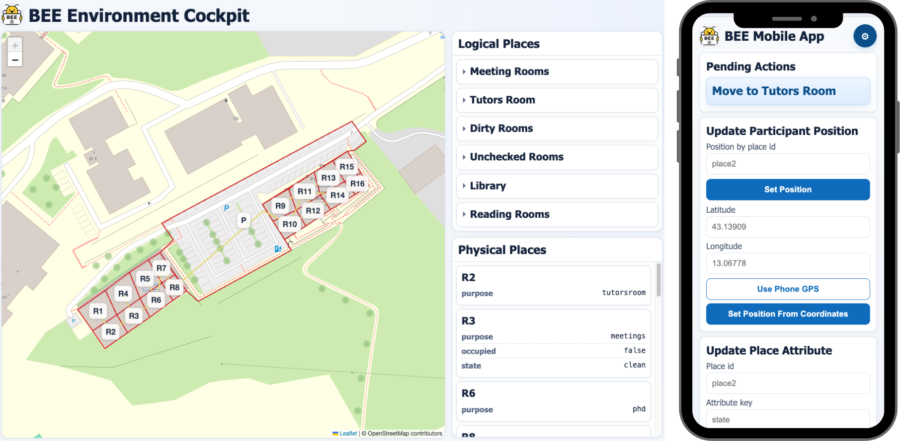

# BEE (BPMN Environmental Enactor)
<table>
   <tr>
      <td align="right" valign="top" width="200">
         
      </td>
      <td valign="top">
         BEE enacts BPMN with environment-aware capabilities, allowing processes to react to a dynamic environment model that processes can reference throughout execution.
         By extending the Camunda 7 platform, BEE includes a BPMN modeler extended with an environment modeler and a BPMN engine capable of interpreting environment-aware BPMN constructs.
         In addition to these, BEE provides a dedicated BEE Environment Cockpit and a companion BEE Mobile App.
      </td>
   </tr>
</table>



## 📁 Project Structure

```
BEE/
├── camunda-modeler/          # Extended Camunda Modeler
│   ├── resources/
│   │   └── plugins/
│   │       └── EaBPM/  # Custom BPMN plugin
│   ├── app/                  # Electron app
│   └── client/              # React client
├── bpenv-modeler/           # BPENV Modeler library (React components)
├── camunda-bpmn-engine/     # Java BPMN engine
└── docker-compose.yml       # Keycloak & PostgreSQL setup

```

## 🚀 Quick Start: Run the Tool Locally

### Prerequisites

- **Node.js** (v18 or higher)
- **npm** (v9 or higher)
- **Java** (JDK 17) - for the BPMN engine
- **Maven** - for building the Java engine

### 1. One-Time Setup

Run these commands from the repository root the first time you set up the project.

**Important:** `bpenv-modeler` must be installed and built before installing `camunda-modeler`, because the modeler and the BEE plugin reference it through local `file:` dependencies.

```bash
cd bpenv-modeler
npm install
npm run build

cd ../camunda-modeler
npm run install-all

cd ../camunda-bpmn-engine
mvn clean install
```

`npm run install-all` installs both:

1. The BEE plugin dependencies (`camunda-modeler/resources/plugins/EaBPM`)
2. The Camunda Modeler dependencies

### 2. Start the Applications

Run the modeler and the engine from the repository root in two separate terminals.

**Terminal 1 - Extended Camunda Modeler**

```bash
cd camunda-modeler
npm run dev:plugin:watch
```

`dev:plugin:watch` is the recommended development command. It builds the BEE plugin, builds `bpenv-modeler`, builds the preload script, then starts the Electron app, the React client, and the relevant watch processes.

If the Electron window appears blank during the first startup, wait 30-60 seconds. The client and plugin may still be compiling.

**Terminal 2 - BEE BPMN Engine**

```bash
cd camunda-bpmn-engine
mvn spring-boot:run
```

### Windows Users

If you are on Windows, use **Git Bash** to run the Camunda Modeler commands. Building the modeler from PowerShell/CMD may fail because of a known Camunda Modeler build issue. See this [forum discussion](https://forum.camunda.io/t/cant-build-camunda-modeler/15177/4) for more details.

### Web Access

| Page | URL |
|---|---|
| Camunda Cockpit | http://localhost:8082/camunda/app/cockpit |
| Camunda Tasklist | http://localhost:8082/camunda/app/tasklist |
| BEE Environment Cockpit | http://localhost:8082/environment.html |
| BEE Mobile App | http://localhost:8082/mobile.html |

To run one of the available scenarios, set the scenario value in `camunda-bpmn-engine/src/main/resources/application.properties` (for example `app.scenario=university`). The engine will load the corresponding configuration from the available case studies in `BPM26_case_studies/`.
If `app.scenario` is not specified in `camunda-bpmn-engine/src/main/resources/application.properties`, you can use the provided environment modeler to create your own environment, export it as a JSON file, and include it in the process deployment as an additional file.

**GPS Disclaimer**: when testing the BEE Mobile App from a mobile phone, GPS coordinates are sent from the browser and require an HTTPS connection. For this reason, you will need to expose your local engine through a tunneling tool (for example `ngrok` or similar). As an alternative, you can set the position manually in the app.

## 🛠️ Optional Development Commands

### Camunda Modeler

**Start with hot reload (recommended):**

```bash
cd camunda-modeler
npm run dev:plugin:watch
```

**Start without watch mode:**

```bash
cd camunda-modeler
npm run dev:plugin
```

Use `dev:plugin` only when you do not need automatic rebuilds. If you change `bpenv-modeler`, rebuild it manually with `cd ../bpenv-modeler && npm run build`. If you change the plugin, rebuild it with `npm run eabpm-plugin:build`.

**Build the packaged desktop application:**

```bash
cd camunda-modeler
npm run build
```

This creates distributable desktop artifacts. It is not required to run the modeler locally. On macOS this step may involve application signing and can fail because of local code-signing or Finder metadata issues.

**Run the full Camunda Modeler validation/build pipeline:**

```bash
cd camunda-modeler
npm run all
```

This runs clean, lint, tests, and distributable builds. It is intended for validation/release workflows, not for simply starting the tool.

### BPENV Modeler Library

```bash
cd bpenv-modeler
npm run dev      # Development mode with hot reload
npm run build    # Production build
npm run test     # Run tests
```

### Plugin Development

The BEE plugin is located at `camunda-modeler/resources/plugins/EaBPM/`.

**Building the plugin:**

```bash
cd camunda-modeler/resources/plugins/EaBPM
npm install
npm run build        # Production build
npm run dev          # Watch mode for development
```

**Note:** After making changes to the plugin, you need to rebuild it. The `dev:plugin` script handles this automatically.

## 📦 Components

### Camunda Modeler

A fork of Camunda Modeler 5.38+ with custom BEE extensions:
- Custom task types (MOVEMENT, BINDING, UNBINDING)
- Environment-aware properties panel
- Spatial BPMN modeling capabilities

**Location:** `camunda-modeler/`

### BPENV Modeler Library

A React component library for environment-aware BPMN modeling:
- Map visualization components
- Environment management UI
- Spatial data handling

**Location:** `bpenv-modeler/`

**Version:** 0.0.23

### BEE Plugin

Custom Camunda Modeler plugin that extends BPMN modeling with:
- Space-aware task types
- Environment properties panel
- Custom palette entries
- Replace menu extensions

**Location:** `camunda-modeler/resources/plugins/EaBPM/`

### Java BPMN Engine

Spring Boot application for executing environment-aware BPMN processes.

**Location:** `camunda-bpmn-engine/`

## 🐳 Docker Services

### Keycloak & PostgreSQL Setup

This project provides a Docker Compose configuration to run **Keycloak** (Identity and Access Management) backed by a **PostgreSQL** database.

#### Prerequisites

- [Docker](https://www.docker.com/get-started) installed on your machine.
- [Docker Compose](https://docs.docker.com/compose/install/) (usually included with Docker Desktop).

#### Getting Started

**1. Environment Configuration**

The project relies on environment variables for configuration. Create a `.env` file in the root directory if it doesn't exist.

**Example `.env` file:**

```env
POSTGRES_DB=eabpmn
POSTGRES_USER=admin
POSTGRES_PASSWORD=admin
KEYCLOAK_ADMIN=admin
KEYCLOAK_ADMIN_PASSWORD=admin
```

**2. Start the Services**

Run the following command to start the containers in the background:

```bash
docker-compose up -d
```

#### Accessing the Services

**Keycloak**
- **URL:** [http://localhost:8083](http://localhost:8083)
- **Admin Console:** Click on "Administration Console"
- **Username:** `admin` (or as defined in `.env`)
- **Password:** `admin` (or as defined in `.env`)

**PostgreSQL**
- **Host:** `localhost`
- **Port:** `5432`
- **Database:** `eabpmn`
- **Username:** `admin`
- **Password:** `admin`

#### Data Persistence

Database data is stored locally in the `./postgres_data` folder.
- This folder is **bind-mounted** to the PostgreSQL container.
- It is included in `.gitignore`, so your local data will **not** be pushed to the repository.
- If you delete this folder, your database will be reset.

## 🔗 Dependencies

### Local Package References

The `camunda-modeler` and the BEE plugin reference `bpenv-modeler` using the `file:` protocol:

- `camunda-modeler/package.json`: `"bpenv-modeler": "file:../bpenv-modeler"`
- `camunda-modeler/resources/plugins/EaBPM/package.json`: `"bpenv-modeler": "file:../../../../bpenv-modeler"`

This ensures they use the local version of `bpenv-modeler` instead of the npm package.

## 📝 Development Workflow

For everyday development, use the Quick Start setup once, then run:

```bash
cd camunda-modeler
npm run dev:plugin:watch
```

This command watches `bpenv-modeler` and the BEE plugin, so changes are rebuilt automatically.

Use `npm run dev:plugin` only if you want to start the modeler without watch mode. In that case:

- Changes to the plugin require `npm run eabpm-plugin:build`
- Changes to `bpenv-modeler` require `cd ../bpenv-modeler && npm run build`

## 🧪 Testing

### Camunda Modeler
```bash
cd camunda-modeler
npm test
```

### BPENV Modeler
```bash
cd bpenv-modeler
npm run test
```

## 📚 Additional Resources

- [Camunda Modeler Documentation](https://docs.camunda.io/docs/components/modeler/desktop-modeler/)
- [Plugin Development Guide](https://docs.camunda.io/docs/components/modeler/desktop-modeler/plugins/)

## 🤝 Contributing

When contributing:
1. Make sure to run `npm run install-all` after pulling changes
2. Rebuild the plugin if you modify it: `npm run eabpm-plugin:build`
3. Test your changes before committing

## 📄 License

See individual component licenses in their respective directories.
